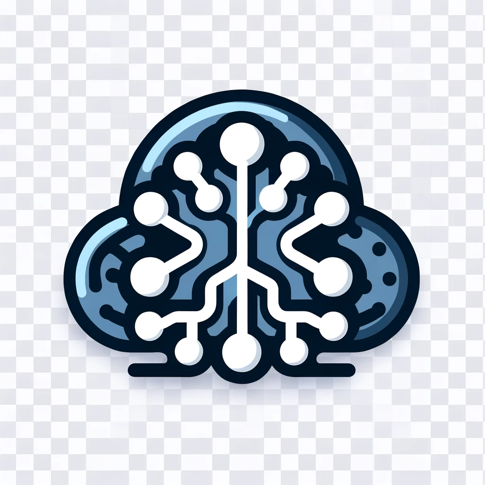

[![Contributors][contributors-shield]][contributors-url]
[![Forks][forks-shield]][forks-url]
[![Stargazers][stars-shield]][stars-url]
[![Issues][issues-shield]][issues-url]
[![Apache License][license-shield]][license-url]

<br/>

[![LinkedIn][linkedin-shield]][linkedin-url]
[![Instagram][instagram-shield]][instagram-url]

<!-- PROJECT LOGO -->
<br />
<div align="center">
  <a href="https://github.com/ruudjuffermans/Kafka-Playground">
    
  </a>

  <h1 align="center">Kafka Playground</h1>

  <p align="center">
Welcome to Kafka Playground! This repository is a personal journey through the fascinating world of Kafka, showcasing learnings, experiments, and insights into Kafka.
    <br />
    <a href="https://github.com/ruudjuffermans/Kafka-Playground"><strong>Explore the docs »</strong></a>
    <br />
    <br />
    <a href="https://github.com/ruudjuffermans/Kafka-Playground">View Demo</a>
    ·
    <a href="https://github.com/ruudjuffermans/Kafka-Playground/issues">Report Bug</a>
    ·
    <a href="https://github.com/ruudjuffermans/Kafka-Playground/issues">Request Feature</a>
  </p>
</div>

## About The Project

There are many great python resources available on GitHub; however, I didn't find one that really suited my needs so I created this enhanced one. I want to create a resource that showcases all the python skills that i know.

Here's why:

- This is a really structured way for me to learn python
- This way im using the official documentation so that I dont only know the common useages of the subjects
- In the end this should result in a resource for others to learn python

## Getting Started

<p align="justify">These instructions will get you a copy of the project up and running on your local machine for development and testing purposes. See deployment for notes on how to deploy the project on a live system.</p>

### Prerequisites

You need Docker to run the following code. 

### Installation

1. Clone the repo

```sh
git clone https://github.com/ruudjuffermans/Kafka-Playground.git
```
